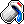
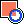

# Am.Paint 0.08.9

---
## Menu

####  New Project: 
create a new canvas of X pixels on Y pixels
the values must be even.

####  Load Project:
load a file in the folder 'Saves'
The list of the files to show is in the file 'Saves/Files.txt'

####  Save Project:
save the project in the folder 'Saves'

####  Export in `.png`: 
export the image in the folder 'Exports'

---
## Tools

####  Pencil
- Draw a pixel in 3 sizes

####  Eraser
- Erase a pixel in 3 sizes

####  Bucket
- Fill contiguneous pixels
- Erase contiguneous pixels
- Fill all pixels by color

####  Shapes
- Draws lined or full rectangle
- Draws lined or full ellipse

#### Line
By pressing the `shift` key, you can draw a line with the Pencil & Eraser tools.

#### Picker
By clicking on a pixel while pressing the `left ctr` key you will set the selected color.

#### Color Swap
Switch the front and back color by pressing `a` key.

#### Move
By pressing `m + arrow` key you can move the content of the current layer.

---
## Canvas

#### Move
By pressing the mousewheel down and drag, you can move the canvas

#### Center Canvas
By pressing `c` you can center the canvas

#### Tiles
Toggle the image tilling by pressing the `t` key.

---
## Layers

####  New Layer

####  Duplicate Layer

####  Delete Layer
####  Move Layer Up/Down

#### Rename a Layer
Right click on a layer to rename it

---
## Viewer
You can change the background color of the viewer to the selected front color by clicking on it.

---
## CONFIG.INI

#### Window
The window dimensions can be defined under the `[WINDOW]` flag
- **width:** between 800px & 1920px
- **height:** between 560px & 1280px

#### Shortcuts
All shortcuts can be defined under the `[SHORTCUTS]` flag

These are the available definitions:
- Save
- Save As
- Export
- Export As
- Center view
- Color picker
- Swap Color
- Move
- Toggle viewer
- Toggle tiles
- Undo
- Redo
- Delete
- Pencil
- Eraser
- Bucket
- Shapes

#### Keymap
If wanted, key bindings can be defined under the `[KEYMAP]` flag

These bindings invert the y and x touches:
```
x = y
y = x
```